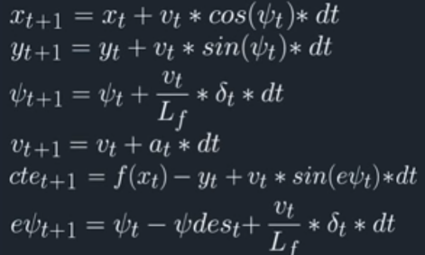

# CarND-Controls-MPC
Self-Driving Car Engineer Nanodegree Program

## Project Description
* The project is to implement Model Predictive Control (MPC) to drive the car around the track in udacity simulator. The simulator provide a feed of value containing the position of the car (px, py), its speed (v) and heading direction (psi). Additionally it also provide the coordinates of waypoints along a reference trajectory that the car is to follow. All the coordinate provided in global coordinate system.  
* Our goal in this project to drive the car around the track by using MPC algorithm which main goal is to minimize the difference between a predicted value and a reference value. The MPC calculate the trajectory, actuations (steering angle and throttel) and sends back to the simulator to drive the car.  
* MPC involves simulating different actuator inputs and predicting resultant trajectory and selecting the trajectory with minimum cost. We are going to use only the immediate MPC predicts value  and feed these value to actuators ( through away rest).  Actuators brings the vehicle to a new state and then repeat the process.  

## The Model :
The vehicle model used in this project is a kinematic bicycle model. It neglects all dynamical effects such as inertia, friction and torque. The model takes changes of heading direction into account and is thus non-linear.  
* The model's state has 6 different values: 
 * px: position in X
 * py: position in Y
 * psi: car's heading direction
 * v: velocity 
 * cte: cross track error
 * epsi: error psi  
* The model has also 2 actuators :
 * steering angle (delta)
 * throttle (a)  
#### The model equations:  

where :
Lf - the distance between the center of mass of the vehicle and the front wheels.

The vehicle model can be found in the class FG_eval.

## Timestep Length and Elapsed Duration (N & dt) :
* Timestep length `N` and elapsed duration `dt` determine the prediction horizon 
* `T = N * dt`. The longer prediction horizon the smoother controller.
* Short prediction horizon causes less accurate, more responsive behavior of controller. 
* I tried various combination of N (7, 10, 15, 20 and 25 ) and  dt (0.01, 0.02, 0.05 and 0.1) to find the optimum value for car drive smooth on sharp curve.
* After some experiments I have chosen the final values of 
	 * N = 20 
	 * dt = 0.05
* The car drives smoothly around the track with velocity up to 40 mph.
* If i increase the speed beyond 40, the car is too wobbly and goes out of the track.

## Polynomial Fitting and MPC Preprocessing :

### MPC PreProcessing :
* The waypoint of car reference trajectory given in global/map coordinate system. 
* These Waypoints are transformed to vehicle coordinate system by translation and rotation. 
* This transformation allows to perform calculations consistently in vehicle coordinate system. The code is as below :  

         // convert from map to vehicle co-ordinate
          for (unsigned int i = 0 ; i < ptsx.size() ; i++ )
          {
        	  double shift_x = ptsx[i] - px ;
        	  double shift_y = ptsy[i] - py ;
        	  ptsx[i] = (shift_x * cos(0-psi) - shift_y * sin(0-psi));
        	  ptsy[i] = (shift_x * sin(0-psi) + shift_y * cos(0-psi));

          }
* ptsx[i] , ptsy[i] are the new waypoint coordinates in vehicle coordinate system.  
* Such transformation allows us to set the current car position and orientation to the value `0`because now the car is located at the origin of coordinate system. 
* That is why we can set the initial state as follows:  

   `state << 0, 0, 0, v, cte, epsi`  

### Polynomial Fitting :
* Once the waypoints are in vehicle coordinate system, A third order polynomial is then fitted .  
 Code as below:
 
         // Type casting ptsx and ptsy from vector to eign vector

          Eigen::VectorXd x_temp = Eigen::Map<Eigen::VectorXd, Eigen::Unaligned>(ptsx.data(), ptsx.size());
          Eigen::VectorXd y_temp = Eigen::Map<Eigen::VectorXd, Eigen::Unaligned>(ptsy.data(), ptsy.size());

          // calculating the polynomial coefficient
          auto coeffs = polyfit(x_temp, y_temp, 3);

## Model Predictive Control with Latency
Additional latency of 100ms is artificially added before sending actuations to the simulator. If we wouldn't handle the latency problem in our controller then oscilations and generally poor trajectories can occur. 
There are mutiple method by which we can incorporate latency into the model:  
1. Predict the state forward at the latency time before feeding into the solver. This will take latency into consideration.  
2. Averaged the first two or three actuations and use that to feed back into the simulator.  
I choose option 1 . Here are my steps :
a) First calculate the new car's new_px and new_py and new_psi at lentency time.  

          // Latency consideration
          double delta = j[1]["steering_angle"];
          double acceleration = j[1]["throttle"];
          const double latency = 0.1;
          px =  px + v * cos(psi) * latency;
          py =  py + v * sin(psi) * latency;
          psi = psi + v * (-delta)/Lf * latency;
          v = v + acceleration * latency;
      
b) Map the waypoints from global coordinates to new_vehicle coordinates.

c) Calucate cte and epsi at the beginning of the time step  

         // calculate cte
          double cte =  0.0 ;
          cte = polyeval(coeffs, 0);

          // calculate epsi
          double epsi =  0.0 ;
          epsi = -atan(coeffs[1]) ;
d) Now calucate update cet and epsi by incorporate the effect of latency.  

          // Taking consideration of simulator latency for cte and epsi
          cte = cte + v * sin(epsi) * latency;
          epsi = epsi + v * delta/Lf * latency;
         
e) Then feed updated values of v, cte and epsi to solver.  
